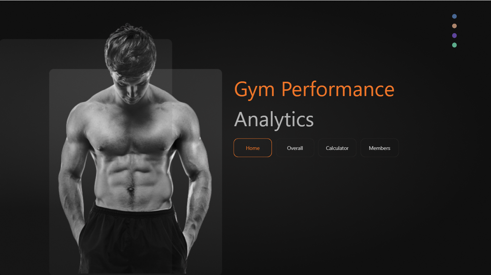
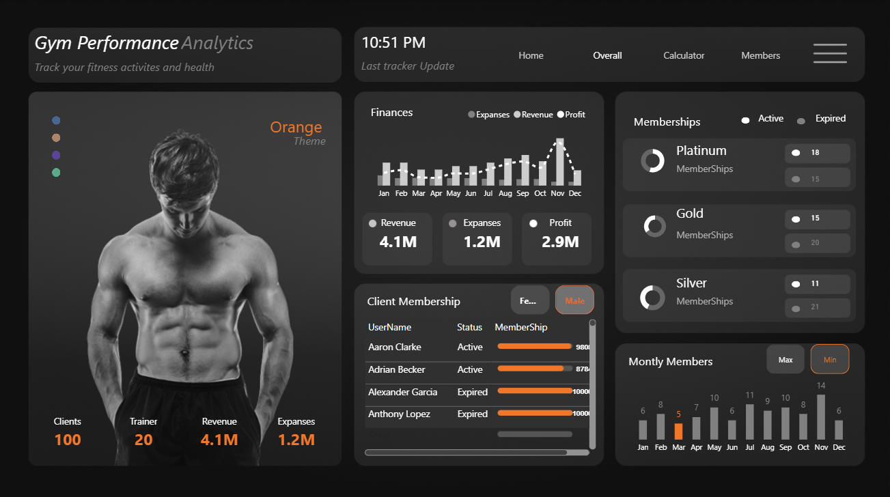
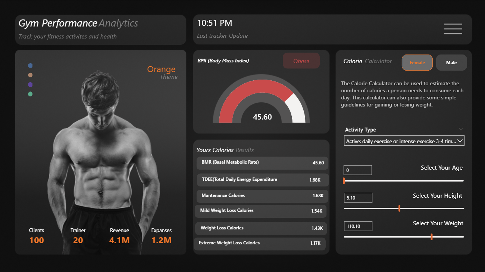
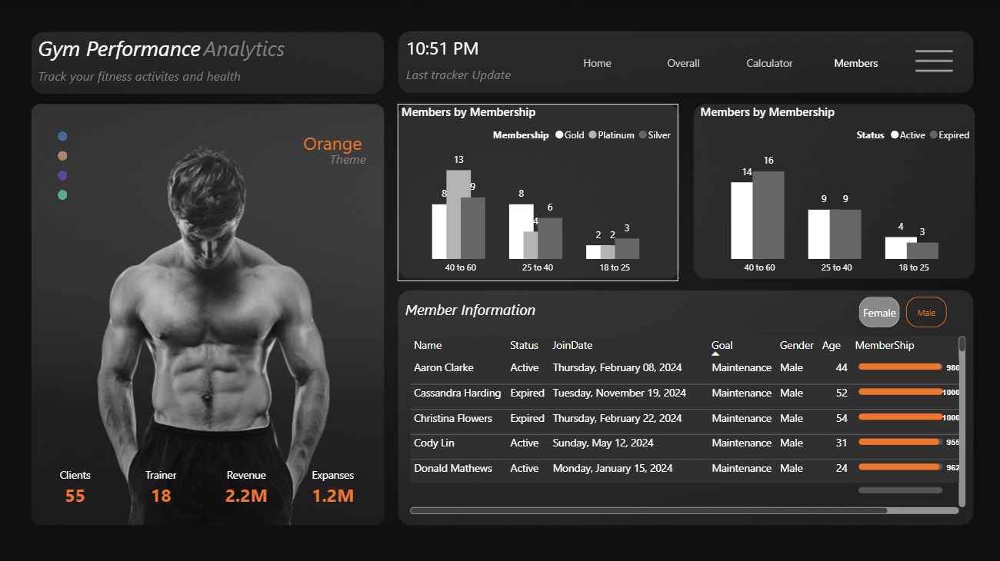

# Gym Performance Analytics

## 🚀 Overview

**Gym Performance Analytics** is a Power BI dashboard designed to help gym owners, personal trainers, and fitness enthusiasts track performance trends, member progress, and key business metrics — all in one interactive, easy-to-use place.

This solution transforms workout, attendance, and revenue data into clear visual insights so you can make data-driven decisions and keep members motivated.

---

## 📊 Key Features

- **Performance Tracking**
  - Analyze individual and group progress over time (weight, reps, sets, duration, etc.)
  - Identify strengths, plateaus, and improvement opportunities

- **Attendance & Engagement**
  - Monitor member check-ins and activity patterns
  - See the most popular classes, times, and coaches

- **Business Metrics**
  - Track monthly membership revenue, churn, and new sign-ups
  - Compare actual performance vs targets

- **Customizable Views**
  - Drill into details via filters and slicers
  - Export charts and tables for reports and sharing

---

## 📥 Getting Started

1. Open `Gym Performance Analytics.pbix` in Power BI Desktop.
2. Connect to your data source (Excel, CSV, database, etc.).
3. Refresh the dataset.
4. Explore the report pages (Overview, Member Insights, Revenue, etc.).

---

## 🖼️ Preview

---

## 🧩 Files in This Repo

- `Gym Performance Analytics.pbix` – Power BI report file
- `Readme.md` – This documentation
- `Project_previews/` –  Screenshots for documentation

---

## 💡 Tips for Customization

- Add calculated measures (DAX) to highlight KPIs like % goal completion or rolling averages.
- Use bookmarks + buttons to create guided “story” navigation.
- Leverage Power BI’s AI visuals (like Q&A) for natural language exploration.

---

## 📣 Feedback & Contributions

If you'd like enhancements or want to share improvements, open an issue or submit a pull request.

---

*Made with passion for fitness and data.*

